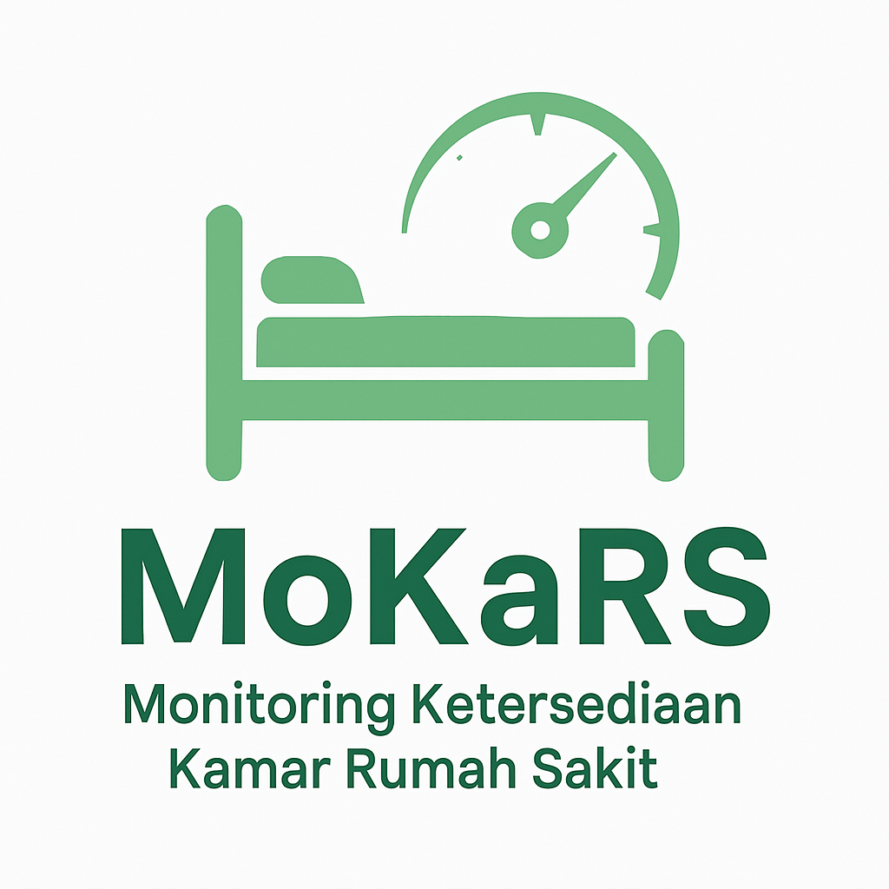

# 🏥 MoKaRS – Monitoring Kamar Rumah Sakit

**MoKaRS** adalah aplikasi mobile berbasis Flutter yang dirancang untuk memantau dan mengelola ketersediaan kamar rumah sakit secara real-time. Aplikasi ini membantu petugas rumah sakit untuk melakukan pencatatan, pemantauan, dan pelaporan status kamar dengan lebih efisien.

## 🚀 Fitur Utama
- 🔍 Melihat status ketersediaan kamar rumah sakit
- 🛏️ Memperbarui status kamar (kosong, terisi, dibersihkan, dll.)
- 📊 Melihat statistik pemakaian kamar
- 🔐 Login berbasis Firestore (tanpa Firebase Auth)

## 🔧 Teknologi
- Flutter
- Firebase Firestore
- Provider / Riverpod (State Management)

## 📂 Struktur Folder
MoKaRS/
┣ lib/
┃ ┣ models/
┃ ┣ pages/
┃ ┣ services/
┃ ┣ widgets/
┃ ┗ main.dart
┣ assets/
┗ pubspec.yaml

yaml
Salin
Edit

## ▶️ Cara Menjalankan
1. Clone repositori ini.
2. Jalankan perintah `flutter pub get`.
3. Konfigurasikan Firebase Firestore (ikuti petunjuk Firebase setup).
4. Jalankan aplikasi menggunakan `flutter run`.

## 👤 Kontributor
- [Nama kamu di sini]

---